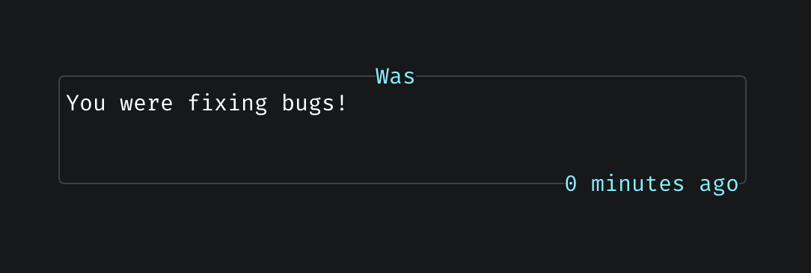

# was.nvim

Neovim plugin to solve "What was I doing here" when moving between dirs.

It's for someone who doesn't need a terminal multiplexer like [tmux](https://github.com/tmux/tmux/wiki) or [zellij](https://zellij.dev) but hops in and out of folders with multiple neovim instances and need to place a mental checkpoint in what they were doing or thinking.



## Features

- Store intentions per workspace (cwd)
- Persistent storage between Neovim sessions
- Minimal and fast
- Written in pure Lua


## Installation

### Prerequisites

- Neovim >= 0.8.0
- [nvim-lua/plenary.nvim](https://github.com/nvim-lua/plenary.nvim)

Using [lazy.nvim](https://github.com/folke/lazy.nvim):

```lua
{
  "bxrne/was.nvim",
  dependencies = {
    "nvim-lua/plenary.nvim", -- for path handling
  },
  config = true, -- calls require('was').setup()
},
```

Using [packer.nvim](https://github.com/wbthomason/packer.nvim):

```lua
use {
  "bxrne/was.nvim",
  requires = {
    "nvim-lua/plenary.nvim", -- for path handling
  },
  config = function()
    require('was').setup()
  end,
}
```

## Configuration

In your Lazy or Packer configuration, you can pass an optional `opts` table to `require('was').setup()`:
```lua
{
  -- "bxrne/was.nvim",
  -- dependencies = {
  --   "nvim-lua/plenary.nvim", -- for path handling
  -- },
  -- config = true, -- calls require('was').setup()
  opts = { -- optional config
    defer_time = 3000, -- default time for window to live for (ms)
  },
}
```

## Usage

Store your current intention:
```vim
:Was Implementing user authentication system
```

View your last stored intention:
```vim
:Was
```

The plugin automatically detects your workspace based on cwd.

Intentions are stored persistently in `~/.local/share/nvim/was/intentions.json`.

## Testing

```bash
nvim --headless -c "PlenaryBustedDirectory tests/ { minimal_init = './tests/minimal_init.lua' }"
```
